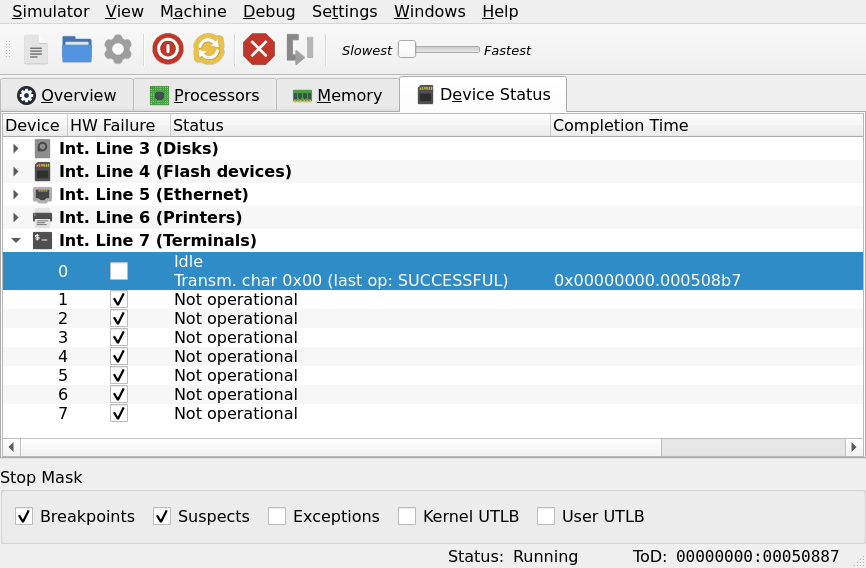
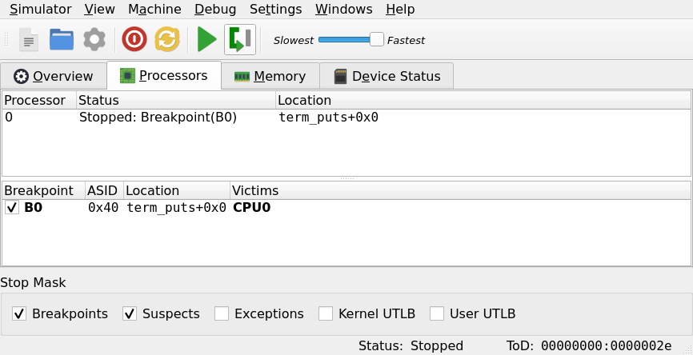
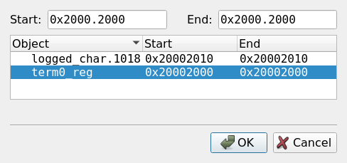
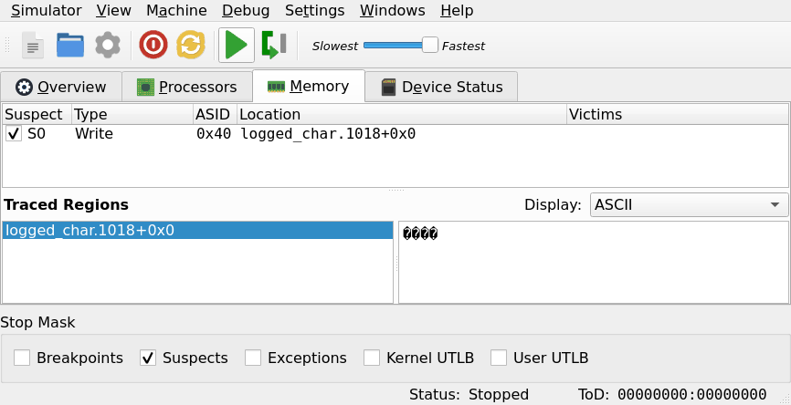

# Debugging features of µMPS3

## Introduction

While developing userspace software the most common practice for problem solving is to look at the output of the program itself, often in the form of some log list (either printed on the terminal or written in a file). When working without an operating system on the other hand those are luxury features: while obtaining a logging output through a character device (in the case of µMPS3, printers and terminals) is not particularly hard the error that is being hunted down might jeopardize the driver for the device itself, leaving you to work with a blind and deaf system.

The µMPS3 GUI integrates built-in debugging support for the emulated processor, providing all the features you might expect from such a tool (except for step-by-step program execution of the C code). Those are invaluable resources when moving your first steps in phases 1 through 3.

## Learning By Example

Here is provided a tour of the debugging facilities through a fabricated bug hunt. For this purpose we will be using the [hello world example](education/tutorials/umps/examples/hello-world.tar.gz) with a slightly changed `term_puts` function.

```C
static void term_puts(const char *str)
{
	while (*str != '0')
		if (term_putchar(*str++))
			return;
}
```

If you compare the two versions the error is easy to spot, but I'll pretend not to see it for the purpose of this document.
Running this modified hello world causes the system to loop while printing an endless stream of gibberish on the terminal 0 after the first `hello, world` message. I will make use of some of the available debugging tools to find out the mistake.

First of all, you might notice that the emulator program is eating up a lot of CPU from your system. This can occur if your program is continously executing a busy loop, which is usually an indicator of something going wrong. You can control the flow of the firmware with the four buttons on the top bar (or the first three options under the `Debug` menu). Stop the execution with the hightlighted button.


## Device Status

Once the execution is paused the first place were you should look for clues is the `Device Status` tab. This tab contains general informations about the operating state of the devices installed on the emulator, and it can be helpful to understand what is going on.

By expanding the terminal drawer you will see some superficial information about the 7 instances of the device class in question. If you choose the default system configuration terminals 1-7 should be marked as *Not operational* while terminal 0 will show the current state and the last operation that was requested.


From here, you can use the *Step* button to move the execution forward one instruction at a time (note: this is one machine instruction, **not** an entire C code line) or slow the execution speed to a more human value and run the program again to analyze what the terminal device is going through.



The device is cycling between three states: idle, transmission done and waiting for ack. It also shows that the transmitted byte is `0`, which is weird because the guard on the while loop should prevent that.

By looking at this tab we can conclude that there is nothing wrong with the terminal device itself; the bug probably does not have anything to do with device configuration (e.g. it could have been a wrong register address).

**Note**: the second column of the device table is marked as *HW Failure*. Rather than a feedback this is a control option: you can induce an hardware problem for a specific device, causing future operations to fail. This is to test the resilience of your system.

## Breakpoints

Continuing with this play pretend debugging session I might ask myself if the `term_puts` function is called multiple times, or if it even returns.
The first question is easy to answer: we can setup a function call breakpoint to stop execution whenever it is invoked. The necessary form is under *Debug > Add Breakpoint* (can also be brought up with *Ctrl+B*): there we can browse a list of all functions declared by our program and choose one for a new breakpoint.
Breakpoints can be enabled or disabled by the checkbox list found at the bottom of the UI. When a checkbox is ticked the emulator will halt execution upon stumbling on the corresponding exception. Make sure the breakpoint option is selected.



Now we reset the emulator and run again. The execution should halt almost immediately, and the *Processors* tab should present the processor 0 stopped at location `term_puts+0x0`. If the function was called multiple times by mistake the execution would stop on that breakpoint again on *Continue*, but we can see that it is not the case.

To check if the function returns we may create another empty function to act as a marker to place arbitrary breakpoints in our program. The name and content does not matter:

```C
void bp(void) {}
```

After compiling again it will appear in the list of available breakpoints, and we can call it just after the `term_puts` call to confirm wether said function ever returns:

```C
void main(void)
{
	term_puts("hello, world\n");
    bp();   // <== BREAKPOINT

	/* Go to sleep and power off the machine if anything wakes us up */
	WAIT();
	*((u32 *) MCTL_POWER) = 0x0FF;
	while (1) ;
}
```

If tested the program appears to never reach the call to `bp`, so the error must be somewhere within the `term_puts` loop.

## Suspect and Traced Region

The last two features for debugging µMPS3 involve memory inspection. A *suspect* is a portion of memory (probably corresponding to a variable) that stops the execution whenever a value is written in it (so long as the *Suspect* checkbox is set). A *traced* memory region has its contents visible in the *Memory* tab of the UI.
These two tools are extremely powerful for in-depth analisys of the program state by inspecting both the content and the consistency of memory write operations. 
Similarly to breakpoints, memory suspects and traces can be selected from a list of program variables. To appear in the list said variable must be statically allocated outside of the stack (i.e. either global or declared `static`) and its name must not start with an underscore (`_`) symbol.

To further inspect why `term_puts` is stuck in a loop I will save each printed character into a specific memory region and check them one by one. To do so I define the following function:

```C
void log_char(char c)
{
    static char logged_char;
    logged_char = c;
}
```

I will then call `log_char` inside the while loop that prints every character of the string. Once the firmware has been recompiled I can setup `logged_char` as both a suspect and a traced region.



Since it is a traced region I can inspect its contents during execution, and the suspect feature stops the execution of the program whenever there is a write operation. This "memory print" works very similarly to a terminal device

**Note**: using a variable as a memory region only means taking it as a baseline; when the variable is selected, the memory address range between *Start* and *End* addresses will be updated accordingly. This range can still be freely manipulated to include any range of memory that the developer might be interested in.

**Note**: symbols whose name starts with an underscore will not appear in the selectable list.

The memory region box can display data in three formats: 

- Hex dump (Big Endian)
- Hex dump (Little Endian)
- Ascii

Since the data I am considering is to be printed on a terminal the Ascii representation is useful. By running the program break by break I can see the characters of the string passing in memory until the newline is reached (0x0A), and then beyond. Looking at the character in memory both as ascii and hex dump it becomes evident how I am checking against the character for the digit `0` instead of the null-terminating symbol, `\0`.



The `log_char` function could easily be expanded to print an entire string in memory instead of a single character. This way the developer can rely on yet another output channel for the operating system, this time one that is not influenced by hardware-related details (interrupts, write times and such).

### Credits:
This page has been contributed by Mattia Maldini
