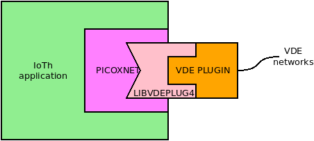
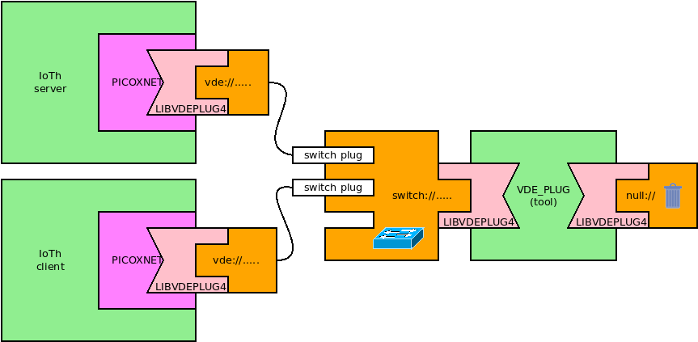

picoxnet: a stack for the IoTh
====

`picoxnet` is a networking stack based on picoTCP-ng designed for the Internet of Thread.



`picoxnet`'s highlights include:

 * it supports multiple stacks:
```
struct picox *picox_newstack(char *vdeurl);
int picox_delstack(struct picox *stack);
```
`picox_newstack` creates a stack with no interfaces (`vdeurl == NULL`) or with one vde interface
named `vde0` and connected to `vdeurl`.
Further interfaces can be added later (see below), the signature of `picox_newstack` facilitates the most common scenario
for the IoTh, an application connected by an interface.
`picox_delstack` deletes a picoxnet stack.

 * it implements the standard Berkeley Sockets API:
```
int picox_msocket(struct picox *stack, int domain, int type, int protocol);
int picox_close(int fd);
int picox_bind(int fd, const struct sockaddr *addr, socklen_t addrlen);
int picox_connect(int fd, const struct sockaddr *addr, socklen_t addrlen);
int picox_listen(int fd, int backlog);
int picox_accept(int fd, struct sockaddr *addr, socklen_t *addrlen);
int picox_getsockname(int fd, struct sockaddr *addr, socklen_t *addrlen);
int picox_getpeername(int fd, struct sockaddr *addr, socklen_t *addrlen);
ssize_t picox_read(int fd, void *buf, size_t len);
ssize_t picox_readv(int fd, const struct iovec *iov, int iovcnt);
ssize_t picox_recv(int fd, void *buf, size_t len, int flags);
ssize_t picox_recvmsg(int fd, struct msghdr *msg, int flags);
ssize_t picox_recvfrom(int fd, void *buf, size_t len, int flags,
    struct sockaddr *from, socklen_t *fromlen);
ssize_t picox_write(int fd, const void *buf, size_t size);
ssize_t picox_writev(int fd, const struct iovec *iov, int iovcnt);
ssize_t picox_send(int fd, const void *buf, size_t size, int flags);
ssize_t picox_sendto(int fd, const void *buf, size_t size, int flags,
    const struct sockaddr *to, socklen_t tolen);
ssize_t picox_sendmsg(int fd, const struct msghdr *msg, int flags);
int picox_setsockopt(int fd, int level, int optname, const void *optval, socklen_t optlen);
int picox_getsockopt(int fd, int level, int optname, void *optval, socklen_t *optlen);
int picox_shutdown(int fd, int how);
int picox_ioctl(int fd, unsigned long cmd, void *argp);
int picox_fcntl(int fd, int cmd, long val);
```
All the functions have the same signature of their counterparts implemented as Linux system calls (without `picox_` prefix).
The only notable exception is `picox_msocket` which has an extra heading parameter to select the `picoxnet` stack.

 * All the stack/interfaces/addresses/route configuration is supported via netlink (see `rtnetlink`(7)). As a consequence
there are __no__ specific (and hardly portable) configuration functions. The stacks can be configured using the
same tools and libraries (like `nlinline`) designed for the kernel stacks (the main stack or networking namespace stacks
like those of `vdens` or `libvdestack`).

 * File descriptors returned by `picox_msocket` can be used in event-waiting system calls like `poll`,`ppoll`, `select`,
`pselect` and `epoll*`. In this way it is possible to write programs managing events generated by different sources like
devices, `stdio` and picoxnet sockets.

 * `picoxnet` is a library so all the management of the communication is handled in the address space of the process.
Multithreading is supported while the picoxnet stacks cannot be _inherited_ by child processes generated by `fork`.  

## IoTh IPv4 client-server



This exmpample implements a TCP echo server and a _terminal like_ client. Both programs use picoxnet, each one has
its own IP address.

### `picox_server4.c`

```C
#define _GNU_SOURCE
#include <stdio.h>
#include <stdlib.h>
#include <libgen.h>
#include <stdint.h>
#include <pthread.h>
#include <netinet/in.h>
#include <arpa/inet.h>
#include <picoxnet.h>
#include <nlinline+.h>
NLINLINE_LIBMULTI(picox_)

#define BUFSIZE 1024

void *handle (void *arg) {
	int connfd = (uintptr_t) arg;
	int n;
	char buf[BUFSIZE];
	printf("new conn %d tid %d\n", connfd, gettid());
	for(;;) {
		if ((n = picox_recv(connfd, buf, BUFSIZE, 0)) <= 0)
			break;
		printf("tid %d GOT: %*.*s",gettid(),n,n,buf);
		picox_send(connfd, buf, n, 0);
	}
	printf("close conn %d tid %d\n", connfd, gettid());
	picox_close(connfd);
	return NULL;
}

void server(int fd) {
	int connfd;
	char buf[BUFSIZE];

	for ( ; ; ) {
		int n;
		pthread_t pt;
		connfd = picox_accept (fd, NULL, NULL);
		if (connfd < 0)
			break;
		pthread_create(&pt, NULL, handle, (void *) (uintptr_t)connfd);
		pthread_detach(pt);
	}
	close(fd);
}

int main(int argc, char *argv[]) {
	if (argc != 5) {
		char *progname = basename(argv[0]);
		printf("Usage: %s vde_net addr prefix port\ne,g,:\n"
				"    %s vxvde://234.0.0.1 10.0.0.10 24 5000\n\n",
				progname, progname);
		return 1;
	}
	struct picox *mystack = picox_newstack(argv[1]); //create the stack
	unsigned int prefix = strtoul(argv[3], NULL, 10);
	unsigned int port = strtoul(argv[4], NULL, 10);
	int ifindex = picox_if_nametoindex(mystack, "vde0"); //get the interface index
	uint8_t ipaddr[4];
	// set the ip address
	if (inet_pton(AF_INET, argv[2], ipaddr) != 1 ||
			picox_ipaddr_add(mystack, AF_INET, ipaddr, prefix, ifindex) < 0) {
		perror(argv[2]);
		return 1;
	}
	// open a picotcp socket
	int fd = picox_msocket(mystack, AF_INET, SOCK_STREAM, 0);
	if (fd < 0)
		return 1;
	// bind the socket to the specific port/any interface
	struct sockaddr_in servaddr = {
		.sin_family = AF_INET,
		.sin_port = htons(port),
		.sin_addr.s_addr = htonl(INADDR_ANY)};
	if (picox_bind(fd, (struct sockaddr *)&servaddr, sizeof(servaddr)) < 0) {
		perror("bind");
		return 1;
	}
	picox_listen(fd, 5);
	server(fd);
	picox_delstack(mystack);
}
```

### `picox-client4.c`

```C
#include <stdio.h>
#include <stdlib.h>
#include <unistd.h>
#include <string.h>
#include <signal.h>
#include <libgen.h>
#include <poll.h>
#include <sys/socket.h>
#include <sys/types.h>
#include <sys/wait.h>
#include <netinet/in.h>
#include <arpa/inet.h>
#include <picoxnet.h>
#include <nlinline+.h>
NLINLINE_LIBMULTI(picox_)

#define BUFSIZE 1024

	void client(int fd) {
		int n;
		char buf[BUFSIZE];
		// this poll uses a picoxnet socket and stdin
		struct pollfd pfd[]={{0, POLLIN, 0}, {fd, POLLIN, 0}};
		for (;;) {
			poll(pfd, 2, -1);
			if (pfd[0].revents) {
				n = read(0, buf, 1024);
				if (n==0) break;
				picox_write(fd, buf,n);
			}
			if (pfd[1].revents) {
				n = picox_read(fd, buf, 1024);
				if (n==0) break;
				write(1, buf,n);
			}
		}
	}

int main(int argc, char *argv[]) {
	if (argc != 6) {
		char *progname = basename(argv[0]);
		printf("Usage: %s vde_net addr prefix client_addr port\n"
				"e,g,:\n"
				"    %s vxvde://234.0.0.1 10.0.0.20 24 10.0.0.10 5000\n\n",
				progname, progname, progname);
		return 1;
	}
	struct picox *mystack = picox_newstack(argv[1]);
	unsigned int prefix = strtoul(argv[3], NULL, 10);
	unsigned int port = strtoul(argv[5], NULL, 10);
	int ifindex = picox_if_nametoindex(mystack, "vde0");
	uint8_t ipaddr[4];
	// set the ip address
	if (inet_pton(AF_INET, argv[2], ipaddr) != 1 ||
			picox_ipaddr_add(mystack, AF_INET, ipaddr, prefix, ifindex) < 0) {
		perror(argv[2]);
		return 1;
	}
	// open a picotcp socket
	int fd = picox_msocket(mystack, AF_INET, SOCK_STREAM, 0);
	if (fd < 0)
		return 1;
	// connect the socket to the specific addr port
	struct sockaddr_in servaddr = {
		.sin_family = AF_INET,
		.sin_port = htons(port)};
	if (inet_pton(AF_INET, argv[4], &servaddr.sin_addr) != 1 ||
			picox_connect(fd, (struct sockaddr *)&servaddr, sizeof(servaddr)) < 0) {
		perror("connect");
		return 1;
	}
	client(fd);
	picox_close(fd);
	sleep(1);
}
```

### compile & run

```
gcc -o picox_server4 picox_server4.c  -lpicoxnet -lpthread
gcc -o picox_client4 picox_client4.c  -lpicoxnet
```
start the switch:
```
vde_plug switch:///tmp/myswitch
```
in two different terminals start the server
```
./picox_server4 vde:///tmp/myswitch 10.0.0.1 24 5000
```
and the client
```
./picox_client4 vde:///tmp/myswitch 10.0.0.2 24 10.0.0.1 5000
```

Now everything is typed-in at the client side is echoed back. The server shows the strings echoed (GOT...).

Terminate the client using EOF (ctrl-D), otherwise the server does not get the termination of the TCP
connection (the server waits for a long timeout).

Note: the server can support several concurrent clients using multiple threads

Note: the client uses a `poll` system call to wait for events from the standard input and from teh picox socket


## IoTh IPv6 client-server

The example presented in the previous section works in IPV6 just by changing the IP addresses and socket types.

### `picox_server6.c

```C
#define _GNU_SOURCE
#include <stdio.h>
#include <stdlib.h>
#include <libgen.h>
#include <stdint.h>
#include <pthread.h>
#include <netinet/in.h>
#include <arpa/inet.h>
#include <picoxnet.h>
#include <nlinline+.h>
NLINLINE_LIBMULTI(picox_)

#define BUFSIZE 1024

void *handle (void *arg) {
	int connfd = (uintptr_t) arg;
	int n;
	char buf[BUFSIZE];
	printf("new conn %d tid %d\n", connfd, gettid());
	for(;;) {
		if ((n = picox_recv(connfd, buf, BUFSIZE, 0)) <= 0)
			break;
		printf("tid %d GOT: %*.*s",gettid(),n,n,buf);
		picox_send(connfd, buf, n, 0);
	}
	printf("close conn %d tid %d\n", connfd, gettid());
	picox_close(connfd);
	return NULL;
}

void server(int fd) {
	int connfd;
	char buf[BUFSIZE];

	for ( ; ; ) {
		int n;
		pthread_t pt;
		connfd = picox_accept (fd, NULL, NULL);
		if (connfd < 0)
			break;
		pthread_create(&pt, NULL, handle, (void *) (uintptr_t)connfd);
		pthread_detach(pt);
	}
	close(fd);
}

int main(int argc, char *argv[]) {
	if (argc != 5) {
		char *progname = basename(argv[0]);
		printf("Usage: %s vde_net addr prefix port\ne,g,:\n"
				"    %s vxvde://234.0.0.1 fc00::2:10 64 5000\n\n",
				progname, progname);
		return 1;
	}
	struct picox *mystack = picox_newstack(argv[1]); //create the stack
	unsigned int prefix = strtoul(argv[3], NULL, 10);
	unsigned int port = strtoul(argv[4], NULL, 10);
	int ifindex = picox_if_nametoindex(mystack, "vde0"); //get the interface index
	uint8_t ipaddr[16];
	// set the ip address
	if (inet_pton(AF_INET6, argv[2], ipaddr) != 1 ||
			picox_ipaddr_add(mystack, AF_INET6, ipaddr, prefix, ifindex) < 0) {
		perror(argv[2]);
		return 1;
	}
	// open a picotcp socket
	int fd = picox_msocket(mystack, AF_INET6, SOCK_STREAM, 0);
	if (fd < 0)
		return 1;
	// bind the socket to the specific port/any interface
	struct sockaddr_in6 servaddr = {
		.sin6_family = AF_INET6,
		.sin6_port = htons(port),
		.sin6_addr = in6addr_any};
	if (picox_bind(fd, (struct sockaddr *)&servaddr, sizeof(servaddr)) < 0) {
		perror("bind");
		return 1;
	}
	picox_listen(fd, 5);
	server(fd);
	picox_delstack(mystack);
}
```

### `picox-client6.c`
```C
#include <stdio.h>
#include <stdlib.h>
#include <unistd.h>
#include <string.h>
#include <signal.h>
#include <libgen.h>
#include <poll.h>
#include <sys/socket.h>
#include <sys/types.h>
#include <sys/wait.h>
#include <netinet/in.h>
#include <arpa/inet.h>
#include <picoxnet.h>
#include <nlinline+.h>
NLINLINE_LIBMULTI(picox_)

#define BUFSIZE 1024

	void client(int fd) {
		int n;
		char buf[BUFSIZE];
		// this poll uses a picoxnet socket and stdin
		struct pollfd pfd[]={{0, POLLIN, 0}, {fd, POLLIN, 0}};
		for (;;) {
			poll(pfd, 2, -1);
			if (pfd[0].revents) {
				n = read(0, buf, 1024);
				if (n==0) break;
				picox_write(fd, buf,n);
			}
			if (pfd[1].revents) {
				n = picox_read(fd, buf, 1024);
				if (n==0) break;
				write(1, buf,n);
			}
		}
	}

int main(int argc, char *argv[]) {
	if (argc != 6) {
		char *progname = basename(argv[0]);
		printf("Usage: %s vde_net addr prefix client_addr port\n"
				"e,g,:\n"
				"    %s vxvde://234.0.0.1 fc00::2:20 64 fec0::2:10 5000\n\n",
				progname, progname, progname);
		return 1;
	}
	struct picox *mystack = picox_newstack(argv[1]);
	unsigned int prefix = strtoul(argv[3], NULL, 10);
	unsigned int port = strtoul(argv[5], NULL, 10);
	int ifindex = picox_if_nametoindex(mystack, "vde0");
	uint8_t ipaddr[16];
	// set the ip address
	if (inet_pton(AF_INET6, argv[2], ipaddr) != 1 ||
			picox_ipaddr_add(mystack, AF_INET6, ipaddr, prefix, ifindex) < 0) {
		perror(argv[2]);
		return 1;
	}
	// open a picotcp socket
	int fd = picox_msocket(mystack, AF_INET6, SOCK_STREAM, 0);
	if (fd < 0)
		return 1;
	// connect the socket to the specific addr port
	struct sockaddr_in6 servaddr = {
		.sin6_family = AF_INET6,
		.sin6_port = htons(port)};
	if (inet_pton(AF_INET6, argv[4], &servaddr.sin6_addr) != 1 ||
			picox_connect(fd, (struct sockaddr *)&servaddr, sizeof(servaddr)) < 0) {
		perror("connect");
		return 1;
	}
	client(fd);
	picox_close(fd);
	sleep(1);
}
```

### compile & run

```
gcc -o picox_server6 picox_server6.c -lpicoxnet -lpthreads
gcc -o picox_client6 picox_client6.c -lpicoxnet
```
start the switch:
```
vde_plug switch:///tmp/myswitch
```
in two different terminals start the server
```
./picox_server6 vde:///tmp/myswitch fc00::1:10 64 5000
```
and the client
```
./picox_client6 vde:///tmp/myswitch fc00::1:20 64 fc00::1:10 5000
```

Now everything is typed-in at the client side is echoed back. The server shows the strings echoed (GOT...).

Terminate the client using EOF (ctrl-D), otherwise the server does not get the termination of the TCP
connection (the server waits for a long timeout).

## An IoTh event driven chat server

## A simple IoTh web server
