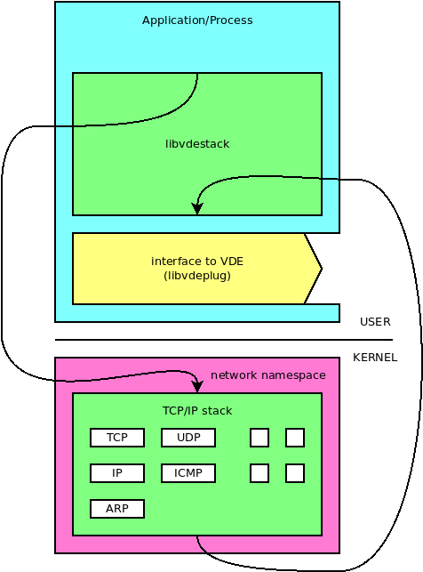
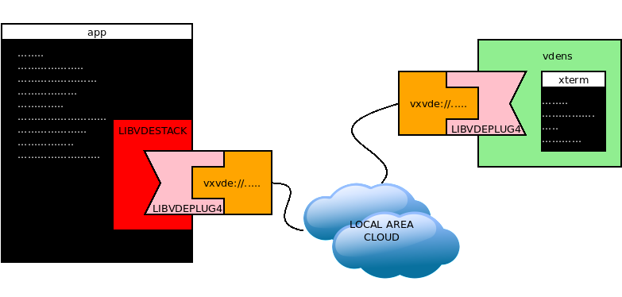

Internet of Threads: vdestack
====

_this tutorial is for programmers_

[libvdestack](https://github.com/rd235/libvdestack) is a library which uses the
Linux kernel implementation of the TCP-IP and makes it available as a user level library.

Note: Actually this is _trick_: the library creates a thread running in a different
_network namespace_. A _tuntap_ interface in that namespace is used to _connect_
the stack back to VDE at user level.



Pros of vdestack:

* the stack implementation is stable, well tested and complete
* the kernel stack can be shared between processed, e.g. in case of `fork`.
* even if it is not fully compliant with the IoTh definition, it provides
a reliable environment to test the applications of IoTh 
* it is a testbed to study a consistent and flexible API for TCP-IP stacks
implemented as user-mode libraries.

Cons of vdestack:

* It is not a user-space implementation.
* Open connections do not _survive_ in case of process migration (the current status 
of the tcp-ip stack is stored in the kernel).

## A vdestack based echo server



The source code of the TCP echo server is [vdestack6.c](/archive/ioth_examples/vdestack6.c).

The structure of the code is:
```C
// ....
#include <vdestack.h>

//...
void server(struct vdestack *mystack) {
	// implementation of a standard TCP echo server
	// using msocket instead of socket:
	fd = vde_msocket(mystack, AF_INET6, SOCK_STREAM, 0);
	// ...
}

struct vdestack *net_setup(void) {
 struct vdestack *mystack;
 mystack = vde_addstack("vxvde://234.0.0.1", NULL);
 vde_stackcmd(mystack,
   "/bin/busybox ip addr add 10.0.0.50/24 dev vde0;"
   "/bin/busybox ip addr add fc00::1:50/64 dev vde0;"
   "/bin/busybox ip link set vde0 up");
 return mystack;
}

int main(int arg, char *argv[]) {
 struct vdestack *mystack = net_setup();
 server(mystack);
 vde_delstack(mystack);
}
```

Notes:

* The function `server` uses IPV6 sockets, so it is able to accept both IPv4 anf IPv6
connections
* `net_setup` assigns the addresses 10.0.0.50 and fc00::1:50 to the interface vde0
if the vdestack. The function `vde_stackcmd` runs one or more commands in the namespace
of the vdestack network. This is a simple way to configure the stack, it is not
portable to TCP-IP stacks implemented as user-space libraries.
* `vde_stackcmd` requires the full pathname for commands. This code uses `busybox`,
`ip` (from iproute) could have been used instead.

```C
vde_stackcmd(mystack,
   "/bin/ip addr add 10.0.0.50/24 dev vde0;"
   "/bin/ip addr add fc00::1:50/64 dev vde0;"
   "/bin/ip link set vde0 up");
```

### compile and test

We can compile and run the code:
```
$ gcc -o vdestack6 vdestack6.c -lvdestack
$ ./vdestack6
```

in another terminal window let us start the `vdens` to complete the structure shown 
in the picture at the beginning of this section. (it is a `vxvde` network, so
this second terminal window can run on any host of the LAN).
```
$ vdens vxvde://234.0.0.1
$# ip addr add 10.0.0.1/24 dev vde0
$# ip addr add fc00::1:1/64 dev vde0
$# ip link set vde0 up
```

Now we can test that `vdestack6` stack is reachable using `ping` (both IPv4 and IPv6)
```
$# ping 10.0.0.50 -c 2
PING 10.0.0.50 (10.0.0.50) 56(84) bytes of data.
64 bytes from 10.0.0.50: icmp_seq=1 ttl=64 time=0.384 ms
64 bytes from 10.0.0.50: icmp_seq=2 ttl=64 time=0.458 ms

--- 10.0.0.50 ping statistics ---
2 packets transmitted, 2 received, 0% packet loss, time 1016ms
rtt min/avg/max/mdev = 0.384/0.421/0.458/0.037 ms
$# ping fc00::1:50 -c 2
PING fc00::1:50(fc00::1:50) 56 data bytes
64 bytes from fc00::1:50: icmp_seq=1 ttl=64 time=0.202 ms
64 bytes from fc00::1:50: icmp_seq=2 ttl=64 time=0.255 ms

--- fc00::1:50 ping statistics ---
2 packets transmitted, 2 received, 0% packet loss, time 1010ms
rtt min/avg/max/mdev = 0.202/0.228/0.255/0.026 ms
```

Now we can test the application, it accepts connections on port 5000:
```
$# nc 10.0.0.50 5000
```
or in IPv6:
```
$# nc fc00::1:50 5000
```

## A vdestack based echo server - using netlink

The function `vde_stackcmd` is a shortcut for `vdestack` only. 
One goal of VirtualSquare is to provide general and portable solutions able to
support `vdestack` as well as other TCP-IP stacks implemented as libraries.

[vdestack6nl.c](/archive/ioth_examples/vdestack6nl.c) is the source code of
the TCP echo server using netlink (the macro library `nlinline`) to configure
the stack.

There are two changes from the code of the previous experiment:

* The inclusion of `nlinline+`
```C
// ...
#include <vdestack.h>
#include <nlinline+.h>
NLINLINE_LIBMULTICOMP(vde_)
```

* the `net_setup` has been rewritten to use netlink.
```C
struct vdestack *net_setup(void) {
 struct vdestack *mystack;
 uint8_t ipv4addr[] = {10,0,0,60};
 uint8_t ipv4gw[] = {10,0,0,1};
 uint8_t ipv6addr[16] = {0xfc, 0x00, [13] = 0x1, [15] = 0x60};
 uint8_t ipv6gw[16] = {0xfc, 0x00, [13] = 0x1, [15] = 0x1};
 int ifindex;

 mystack = vde_addstack("vxvde://234.0.0.1", NULL);
 ifindex = vde_if_nametoindex(mystack, "vde0");
 if (ifindex < 0) {
  perror("nametoindex");
  exit(1);
 }

 if (vde_linksetupdown(mystack, ifindex, 1) < 0)
  perror("link up");
 if (vde_ipaddr_add(mystack, AF_INET, ipv4addr, 24, ifindex) < 0)
  perror("addr ipv4");
 if (vde_iproute_add(mystack, AF_INET, NULL, 0, ipv4gw) < 0)
  perror("route ipv4");
 if (vde_ipaddr_add(mystack, AF_INET6, ipv6addr, 64, ifindex) < 0)
  perror("addr ipv6");
 if (vde_iproute_add(mystack, AF_INET6, NULL, 0, ipv6gw) < 0)
  perror("route ipv6");

 return mystack;
}
```

The macro `NLINLINE_LIBMULTICOMP(vde_)` defines all the specific inline functions
of nlinline for vdestack (e.g. `vde_if_nametoindex`, `vde_linksetupdown`, etc).

This version does not rely on external commands, is uses only netlink sockets
to configure the stack. This works for `vdestack` but it is compatible with any
other stack provided it supports its configuration via netlink.

### compile and test

We can compile and run the code:
```
$ gcc -o vdestack6nl vdestack6nl.c -lvdestack
$ ./vdestack6nl
```

using the same second terminal window of the previous example let us test
the reachability (`ping`):
```
$# ping fc00::1:60 -c 2
$# ping 10.0.0.60 -c 2
PING 10.0.0.60 (10.0.0.60) 56(84) bytes of data.
64 bytes from 10.0.0.60: icmp_seq=1 ttl=64 time=0.712 ms
64 bytes from 10.0.0.60: icmp_seq=2 ttl=64 time=0.333 ms

--- 10.0.0.60 ping statistics ---
2 packets transmitted, 2 received, 0% packet loss, time 1008ms
rtt min/avg/max/mdev = 0.333/0.522/0.712/0.189 ms
PING fc00::1:60(fc00::1:60) 56 data bytes
64 bytes from fc00::1:60: icmp_seq=1 ttl=64 time=0.304 ms
64 bytes from fc00::1:60: icmp_seq=2 ttl=64 time=0.167 ms

--- fc00::1:60 ping statistics ---
2 packets transmitted, 2 received, 0% packet loss, time 1003ms
rtt min/avg/max/mdev = 0.167/0.235/0.304/0.068 ms
```

The application can be tested in IPv4:
```
$# nc 10.0.0.60 5000
```
or in IPv6:
```
$# nc fc00::1:60 5000
```
