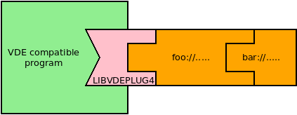
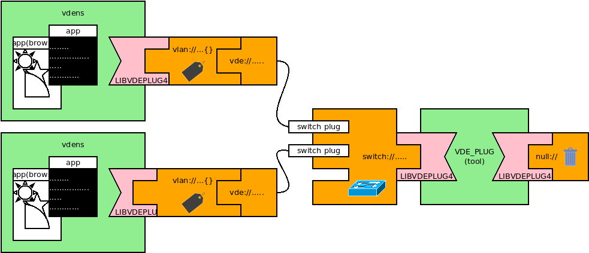
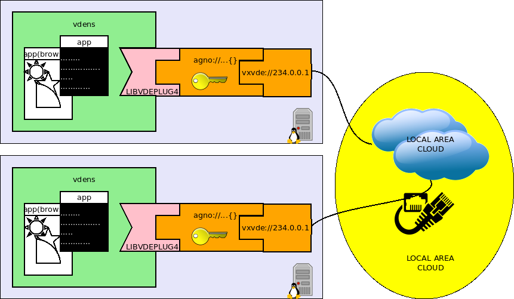

VDE nesting plugins
====


VDE supports the idea of *nesting plugins*. As depicted in the picture above this kind of plugins
can be put between the client and an ordinary plugin. These plugins can provide services like
encryption or packet encapsulation.

They logically implement a communication layer and can be used with any VDE client and any plugin.

The VNL (Virtual Network Locator) syntax for nesting plugins is the following:



`foo://....{bar://...}` means that `foo` is the nesting plugin connected to `bar`.

The syntax can be further nested: `foo://...{bar://...{baz://...}}`


## VDE clients using a VLAN

The (nesting) plugin named `vlan` implements the VLAN protocol as defined by IEEE 802.1q.



### start the switch
This example requires three terminals. Start a switch in the first:
```
$ vde_plug null:// switch:///tmp/mysw
```

### start the two vdens
In the other two terminals start vdens:
```
$ vdens vlan://4{vde:///tmp/mysw}
$#
```
assign suitable IP addresses to the `vde0` interfaces of the namespaces. In one `vdens`:
```
$# ip addr add 10.0.0.40/24 dev vde0
$# ip link set vde0 up
```
and in the other:
```
$# ip addr add 10.0.0.41/24 dev vde0
$# ip link set vde0 up
```

Now use ping to test that the virtual ethernet is up and running.

Hint: change the switch with a hub (`vde_plug null:// hub:///tmp/mysw`) and start 
`vdens vde:///tmp/mysw` in a fourth terminal. Enable the `vde0` interface (`ip link set vde0 up`) and run `wireshark`.
In this way it is possible to see that the packets have effectively been tagged.

## An encrypted Local Area Cloud

`agno` is the nesting plugin providing agnostic encryption of the ethernet packets.
Agnostic means it is a general purpose encryption service at the data link layer so it does not care
to the application protocols running at the upper layers.



This plugin uses a shared key, 

### Create the key file

`agno` uses a 128bit key. The key file consists of 32 exadecimal digits. Spurious characters are simply ignored.
The  key file can be conveniently created from a passphrase using `md5sum`:
```
(umask 077; echo "secret" | md5sum > ~/.vde_agno_key)
```
Note: When the VDE clients run on different hosts the key file must exist and have the same contents on
all the hosts.

### Run the vdens clients

```
vdens agno://{vxvde://234.0.0.2}
```
add suitable IP addresses and enable `vde0` as above.

The encrypted local area cloud is running. 

## VDE and IEEE 802.1ad also known as QinQ


This combination of VDE plugins implements the [IEEE 802.1ad protocol](https://en.wikipedia.org/wiki/IEEE_802.1ad) on
VDE networks.

```
vdens vdens vlan://4{vlan://5/qinq{vde:///tmp/h}}
```
in this example `vdens` is connected to the VLAN 4 of the QinQ VLAN 5.

## VLAN in encrypted networks


```
vdens vlan://4{agno://{vxvde://234.0.0.2}}
```
This is the syntax to join the VLAN4 of the encrypted network.

Note: the sequence of the plugins is very important `agno://{vlan://4{vxvde://234.0.0.2}}` means
that the VLAN 4 is encrypted (other VLANs or untagged packets can be unencrypted or use different
encryptions).
