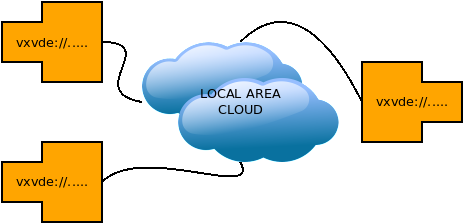
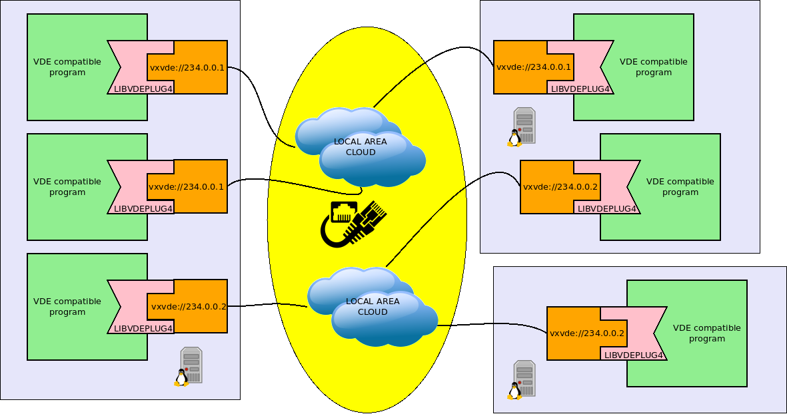
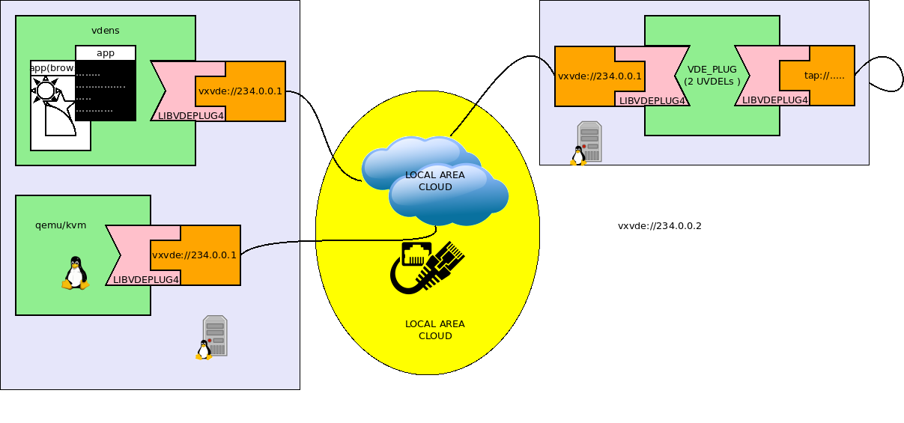

VDE Local Area Cloud: vxvde
====

The usage scenario of `vxvde` is a Local Area Network connecting several Linux boxes.

The way to create a VDE using `vxvde` is straightforward simple:

* run the VDE clients to be connected by the VDE on any Linux host of the LAN (scattered on
different hosts or all on the same host, it does not matter. Maybe the best cohice is to
balance the load among the available hosts).
* Use the same VNL for all the VDE client that has to join the same VDE. A `vxvde` network
is identified by a Ip multicast address and a port (the default port 14789 is used if the port is
omitted). e.g. `vxvde://234.0.0.1`.

If _bird of the same feather flock together_ in the same way VDE clients using the same IP multicast address (and port)
join the same VDE. This is a Loxal Area Cloud of VDE clients.



Pros of `vxvde`:

* requires no configuration. `vxvde` implements the idea of distributed virtual ethernet switch. There are no other
deamons/servers/virtual switches involved.
* it is fast. Unicast ethernet packets sent on the virtual network geet sent directly from the Virtual MAchine monitors
incapsulated in UDP unicast packets.  The sole overhead is the UDP header required for the encapsulation. There are no extra costs
of synchronization with other processes.

Cons of `vxvde`:

* there is no access control to the `vxvde` virtual networks. Any user having a standard shell access on the
hosts of the LAN (and enabled to run programs involving the use of the network) can add VDE clients to the active Local Area Clouds.
* there is no encrytion

Note: In many scenarios these limitations are not problems. For example in Data Centers providing Virtual Machines to their
customers (i.e. suppliers of IaaS cloud nodes), only the employees have shell access to the physical hosts and
can add nodes to the physical network, so there is no way for customers to join, snoop or tamper virtual networks
belonging to others.

Hint: VirtualSquare has designed tools that can be used to solve the problems of `vxvde` (to the cost of a lower performance
and increased architecural complexity): `libpam-net`: support the creation of users havinig no or limited network access,
`libvdeplug_agno`: a nested plugin for encryption, `vxvdex`: a kernel module provididng access control for `vxvde` networks.

Warning: if `vxvde` runs on hosts with several network controllers (multi homed hosts) a specific option may be needed to specify
the controller to use. e.g. `vxvde://234.0.0.1/if=eth1`.



### hands on: let us build a Local Area Cloud

This example creates a local area cloud to conenct:

* a qemu.kvm Virtual Machine
* a `vdens` namespace
* a tap interface



The implementation of this example requires three virtual terminals.
It is possible to use terminals of the same host (e.g. of the virtual machine configured for this tutorial).
A more interesting scenario would be to take terminals of different hosts of the same local area network.
Clearly all the hosts involved in this experiment must have VDEplug4 installed.

In the first terminal run the following commands:
```
$ su -
# ip tuntap add mode tap name tap0 user user
# ip addr 10.0.0.254/24 dev tap0
# ip link set tap0 up
# exit
$ vde_plug tap://tap0 vxvde://234.0.0.1
```

In the second, start the `vdens`:
```
$ vdens vxvde://234.0.0.1
$# ip addr add 10.0.0.20/24 dev vde0
$# ip link set vde0 up
```

Use the third to run the qemu/kvm VM:
```
qemu-system-x86_64 -cdrom alpine-virt-3.12.0_rc5-x86_64.iso -monitor stdio \
    -device e1000,netdev=vde0,mac=$(randmac -q) -netdev vde,id=vde0,sock=vxvde://234.0.0.1
```
Log in as root in the VM and configure its eth0 interface.
```
# ip addr add 10.0.0.21/24 dev eth0
# ip link set eth0 up
```

Now from the VM and from the `vdens` namespace it is possible to ping 10.0.0.20, 10.0.0.21 and 10.0.0.254.

Our Local Area Cloud is up and running.

