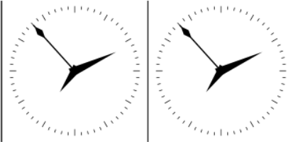
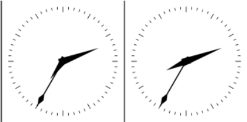
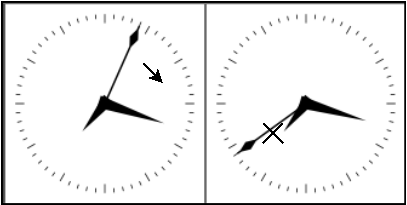
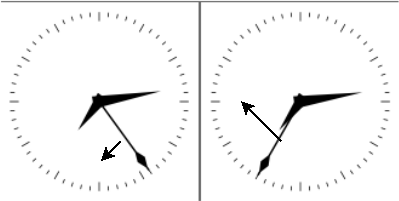
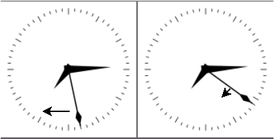

`vumisc`: VUOS virtual time, etc
====

## The VUOS time relativity

This experiment shows how it is possible to virtualize the perception of the
time in VUOS.

We need a clock application. The command `date` works is not very convenient for this
example. I  should be executed repeatedly to see how the time flows.

Our suggestion is to use `xclock`.
If it not installed in your system it can be easily added, it is included in the Debian
package `x11-apps`.

Run:
```
# apt-get install x11-apps
```

Start a clock from a non-VUOS shell:
```
$ xclock -update 1
```


Note: if you are using the virtual machine image as described [here](vuosbasics.md),
from a terminal window of the hosting system run 
`ssh -X -p 2222 user@localhost xclock -update 1`.

Now start a VUOS session and run:
```
$$ xclock -update 1 &
$$ vu_insmod vumisc
$$ vumount -t vumisctime none /mnt
$$ ls /mnt
base  frequency  offset
$$
```

These commands start a second `xclock`, load the `ummisc` module and activate
the `vumisctime` submodule.
The file system that `vumount` makes accessible on `/mnt` consists of 
three virtual files:

* offset: difference in seconds between the real and virtual time
* frequency: the _pace_ of a virtual second with respect to a real second
* base: base time for the frequency change.

Note: for the interested readers the formula of the virtual time is
`Virt-time = ((real-time - base) * frequency) + base + offset`

### some practical examples

Now the two xclocks are synchronized. The first one launched shown the time
as seek by the Linux kernel, the second is showing the virtual time.



This command:
```
$$ echo 3600 > /mnt/offset
```
add an hour of the virtual time, The hour arm of the virtual `xclock` moves
correspondingly.



Warning: `xclock` has not been designed to go backwards. So if virtual time
is decreased the `xclock` must be closed and restarted.

Now let us stop the flowing of the virtual time:
```
$$ echo 0 > /mnt/frequency
```
The second harm stops.



The frequency can be modified: the virtual time can go fast:
```
$$ echo 2 > /mnt/frequency
```



or slow:
```
$$ echo 0.5 > /mnt/frequency
```



if `frequency` is set to a negative number: the virtual time flows backwards.
`xclock` is not able to show this. it can be shown using the command `date`.

```
$$ echo -1 > /mnt/frequency
$$ date
Thu 13 Aug 2020 07:25:55 PM CEST
$$ date
Thu 13 Aug 2020 07:25:53 PM CEST
$$ date
Thu 13 Aug 2020 07:25:52 PM CEST
$$ date
Thu 13 Aug 2020 07:25:51 PM CEST
$$ date
Thu 13 Aug 2020 07:25:50 PM CEST
$$ date
Thu 13 Aug 2020 07:25:49 PM CEST
$$ date
Thu 13 Aug 2020 07:25:48 PM CEST
renzo@eipi[305642]:~$
```
