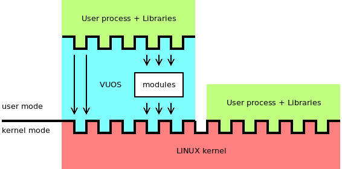

VUOS/umvu basic concepts
====

VUOS is a modular, configurable and Linux compatible operating system kernel
running as a user program on GNU/Linux hosts.

VUOS is a different perspective on namespaces, anykernels and related concepts.
The main idea behind VUOS is that it is possible to give processes their own
"view" using partial virtual machines.




A partial virtual machine intercepts the system call requests and operates like
a filter: system call can be forwarded to the kernel of the hosting system or
processed by the partial virtual machine hypervisor.

In this way processes can see a mix of resources provided by the kernel (on
which they have the same view of the other processes) and virtual resource.
It is possible to mount filesystems, load networking stack, change the
structure of the file system tree, create virtual devices.

The hypervisor is just a user process so while it gives new perspective for
processes, __it does not widen the attack surface of the kernel__.

`umvu` is a VOUS hypervisor (based on ptrace and bpf-seccomp).

## first steps in VUOS

The command line to start `umvu` requires a command (and its argument).

For example, this command:

```bash
$ umvu bash
$
```
starts the hypervisor and a `bash` controlled by the hypervisor.
If you are using the [virtual machine](setup_the_vm.md) for this tutorial
the prompts will be like:
```bash
user@V2-20200620-303:~$ umvu bash
user@V2-20200620-303[722]:~$
```

The number in square brackets is the pid of the hypervisor. It permits to
discover from the promt which shell prompts are waiting for commands for the hosting system
and which for a VUOS session.

Hint: Append the contents of 
[this file](https://raw.githubusercontent.com/virtualsquare/virtualsquare.github.io/master/archive/install_scripts/append_to.bashrc) 
at the end of your `.bashrc` file to get a prompt
including the hypervisor's pid, and the list of currently granted capabilities.

Another convenient way to start `umvu` for those who are using the [virtual machine](setup_the_vm.md)
for this tutorial consists of the activation of an xterm session. From a terminal session of the hosting computer
run:
```bash
$ ssh -p 2222 -X user@localhost umvu xterm
user@localhost's password:
```
As soon as the correct password has been typed ini, an xterm window appears. This xterm is running in the VM
and it is under the control of a VUOS hypervisor. This latter method permits to run programs using X-window GUIs. Moreover
the feedback messages of the hypervisor (errore or debug messages) is printed on one terminal (the one of the hsoting computer)
while the standard output of the programs running in VUOS appears on the other window.

Note: if you have installed `umvu` on a Linux host and using a graphical session (like gnome or kde) it is possible
to get the same _separation of output_ using the command `umvu xterm`.

Note: In the following examples we'll use `$$` as the prompt of a shell under the VUOS hypervisor control.
(as if the user has set `PS1='\$\$ '`

At this point the hypervisor is ready to provide processes with their own _views_ but it requires to load _modules_ and to mount
_submodules_ in order to configure the requested services. In other words, the hypervisor has been interposed but it tranparently forwards 
all the system calls to the kernel, so the processes running under the hypervisor control have the same _view_.

This is the _view_ for a process running directly on the hosting system:


This picture depicts the situation for a process running under `umvu`'s control:


## VUOS modules

Each VUOS module enables a kind of virtualization. In fact modules implement the core common part required to implement a virtual view
of a specific type.

Examples of modules include:

* `vufs`: file system _patchworking_. Move, hide, give copy-on-write access, merge file, directories and file system subtrees.

* `vufuse`: VUOS implementation of file system in userspace. Mount file system images.

* `vudev`: create virtual devices

* `vunet`: network virtualization

* `unreadiudgid`: permit virtual seuid/setgid

The command to add a module is `vu_insmod`. e.g.:

```bash
$$ vu_insmod vufs
$$ vu_lsmod
vufs: vu filesystem patchworking
$$
```

`vu_lsmod` lists the currently loaded modules and `vu_rmmod` deletes a module (removal is forbidden if the module is in use).
Please refer to the [man pages](/man/index.md) for the a detailed description of these commands.

## VUOS submodules

Submodules implement specific virtualizations of the type defined by their modules. Submodues name have the name of their module 
as a prefix. Some examples follow:

* `vufuseext2` is the module of `vufuse` that supports the mounting of ext2/3/4 filesystems.

* `vudevpartx` is the module of `vudev` to mount a disk image and create virtual devices for its partitions.

Submodules are specified as types (option `-t`) in the __mount__(8) command
Some modules do not have submodules.

## The role of the "mount" operation
